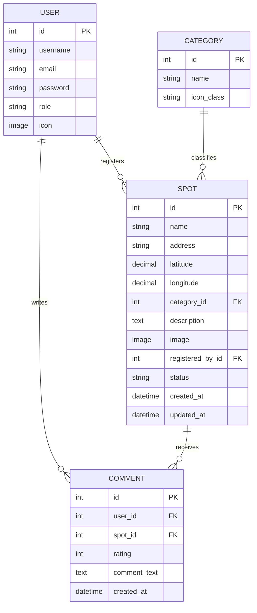

# 学生生活マップ 詳細設計書

作成日: 2026-09-17

## 1. 概要・目的

企画書に基づき、本設計書ではシステムを実際に実装可能なレベルまで技術的に詳細化する。特に企画書内で不十分だった以下2点を重点的に詰める。

- **技術スタック**：何を使ってどう作るか（フロントエンド／バックエンド／DB／地図／認証など）
- **DB設計**：テーブル構成・カラム定義・外部キー関係

### 対象ユーザー

| ロール | 概要 |
|---|---|
| 学生（一般ユーザー） | スポットの閲覧・検索・評価コメント投稿を行う。スポット登録は経営者ロールが担当する |
| 経営者 | スポット情報（店舗・施設）の登録を行う。経営者が存在しないカテゴリ（ATM・バス停・トイレ等）の登録主体は別途要検討 |
| 管理者 | 登録されたスポットの承認・却下 |

> 補足：企画書では学生テーブル・管理者テーブルを別々に定義していたが、氏名・メール・パスワードなど共通項目が重複するため、Djangoの認証ユーザーを1テーブルに統合し `role` カラムで区別する方式を採る（学生／経営者／管理者の3種。詳細は4章）。

## 2. 技術スタック

| 分類 | 採用技術 | 理由 |
|---|---|---|
| バックエンド | Django（Python） | 認証・管理画面・ORMが標準搭載で、DB設計から画面実装まで一貫して1フレームワークで完結できる |
| フロントエンド | Djangoテンプレート ＋ Bootstrap 5 ＋ 素のJavaScript | React等のSPA構成は不要な規模。テンプレートで十分かつ学習コストが低い |
| 地図 | Leaflet.js ＋ OpenStreetMap | 課金設定・APIキー登録が不要（Google Maps APIは見送り済み）。ただしOpenStreetMap公式タイルサーバーは寄付運営のため「常識的な範囲の閲覧トラフィック」を前提とした利用ポリシーがあり、帰属表示（© OpenStreetMap contributors）必須・オフライン一括ダウンロード禁止・過度なアクセスは予告なくブロックされ得る。卒業制作規模のアクセス量なら問題にならないが、公開後にアクセスが急増した場合はMapTilerなど有料タイルへの切替を検討する。地図データ自体（OSM）はオープンデータとして無料。精度は地域差があり、日本国内は都市部中心に概ね良好だが、Googleマップほど頻繁に更新されないため小規模店舗の情報が古い・未掲載なことがある |
| ジオコーディング | Nominatim（OSM提供の無料API） | 住所からの緯度経度取得に利用。スポット登録時に住所を入力すると自動変換し、`latitude`/`longitude`に保存する。利用制限（1リクエスト/秒、公式ポリシー）があるため、登録フォーム側でのリトライ・エラー表示を用意する。また日本語住所の書き方によっては変換精度が下がる場合があるため、④の「地図上でピンを手動調整できる代替手段」と併用する |
| データベース | 開発：SQLite（Django標準・追加設定不要）／本番想定：PostgreSQL | 卒業制作の規模ではSQLiteで十分。将来的に負荷が増えた場合のみPostgreSQLへ移行できるようDjangoのORMのみでクエリを書く（生SQLを書かない） |
| 認証 | Djangoの`AbstractUser`を継承したカスタムUserモデル ＋ `role`カラム | 学生／経営者／管理者で共通のログイン機構を使い回せる。パスワードはDjango標準のPBKDF2ハッシュで保存 |
| 画像保存 | Django `ImageField` ＋ Pillow ＋ ローカルmediaディレクトリ（開発時） | 卒業制作の期間ではクラウドストレージ（S3等）は過剰。将来的にAWS S3へ差し替える場合も`ImageField`のstorage設定を変えるだけで済む |
| 管理者機能 | Django Admin をカスタマイズして利用 | スポットの承認・却下用に`admin.py`でカスタムアクション（一括承認／却下ボタン）を追加すれば、専用の管理画面をゼロから作らずに済む |
| 開発環境 | Python仮想環境（venv）＋ `requirements.txt`（Django, Pillow, requests※Nominatim呼び出し用） | 環境差異を防ぎ、AIに読み込ませて再現環境を構築させやすくする |

> 選定方針：卒業制作という期間・チーム規模の制約上、「新しい技術に挑戦する」より「Django標準機能で完結させる」ことを優先した。独自実装が必要なのは地図表示（Leaflet.js）とジオコーディング（Nominatim）の連携部分のみ。

### ジオコーディングAPIの比較検討

| API | 費用 | レート制限 | 日本住所への強さ | ブラウザから直接呼べるか |
|---|---|---|---|---|
| Nominatim（OSM、現在の採用案） | 無料 | 1リクエスト/秒（ハード制限） | 海外含む汎用。日本語住所表記でやや精度が落ちることがある | 可（User-Agent必須） |
| 国土地理院 AddressSearch API | 無料・APIキー不要 | 公式な明記は見当たらないが節度ある利用が前提 | 日本の住所データ専用なので国内住所には強い | 可（CORS許可済み） |
| Yahoo!ジオコーダAPI | 無料（1日5万リクエストまで） | 1日5万件 | 日本住所に対応 | 可。ただしYahoo!デベロッパーネットワークのクライアントID登録が必要 |
| Google Geocoding API | 従量課金（無料枠あり、要クレジットカード登録） | プランに応じる | 精度は高いという評価が多い | APIキー必須・課金設定が前提（Leaflet採用時に見送った理由と同じ） |

> 水戸市内の住所（国内住所のみ）を扱うという前提なら、**国土地理院のAddressSearch APIの方がNominatimより向いている可能性が高い**（日本の住所データに特化・APIキー不要・CORS許可済みでフロントから直接呼べる）。ただし公式なレート制限の明記が見当たらないため、採用する場合も簡易なキャッシュ・リトライ処理は入れておくことを推奨する。乗り換えるかどうかは要判断（現時点ではNominatimのまま4章・5章の記述を残している）。

## 3. システム構成（Djangoアプリ分割）

機能ごとにDjangoアプリを分割し、AIに実装を依頼する際も「どのアプリのどのファイルを触るか」を指示しやすくする。

```
student_map/              # プロジェクトルート
├── config/                # プロジェクト設定（settings.py, urls.py）
├── accounts/              # ユーザー認証・カスタムUserモデル
│   ├── models.py          # Userモデル（role含む）
│   ├── views.py           # 会員登録（自作）＋ ログイン/ログアウト（Django標準ビューを流用）
│   └── forms.py
├── spots/                 # スポット関連（本システムの中心機能）
│   ├── models.py          # Category, Spot モデル
│   ├── views.py           # 地図表示・検索・登録・承認
│   ├── forms.py           # スポット登録フォーム（住所→ジオコーディング処理含む）
│   └── admin.py           # 承認・却下アクションを追加したDjango Admin設定
├── reviews/               # コメント・評価機能
│   ├── models.py          # Comment モデル
│   └── views.py
├── templates/             # 各アプリ共通テンプレート
├── static/                # CSS・JS（Leaflet.js読み込み含む）
└── media/                 # アップロード画像（開発時）
```

### アプリ間の依存関係

- `spots`は`accounts`のUserモデルを外部キーで参照する（誰が登録したか）
- `reviews`は`accounts`と`spots`の両方を外部キーで参照する（誰がどのスポットに評価したか）
- 依存の向きは一方向（`accounts` ← `spots` ← `reviews`）に統一し、循環参照を避ける

## 4. データベース設計

企画書の4テーブル構成（学生／管理者／スポット／コメント）を、Django向けに4テーブル構成へ再編する。学生・管理者を1つの`User`テーブルに統合し、代わりに独立していなかった「カテゴリ」を`Category`テーブルとして正規化した。

### ER図



### 4-1. User（accounts.User）※Djangoの`AbstractUser`を継承

| カラム名 | 型 | 制約 | 説明 |
|---|---|---|---|
| id | AutoField | PK | Django標準の主キー |
| username | CharField(150) | unique | ログインID |
| email | EmailField | unique | メールアドレス |
| password | CharField | — | Django標準のPBKDF2ハッシュで自動保存 |
| role | CharField(10) | choices=['student','business','admin'], default='student' | 学生／経営者／管理者の区別 |
| icon | ImageField | blank=True, null=True | プロフィールアイコン（任意） |
| date_joined | DateTimeField | auto_now_add | Django標準で自動付与 |

### 4-2. Category（spots.Category）※企画書にない新設テーブル

| カラム名 | 型 | 制約 | 説明 |
|---|---|---|---|
| id | AutoField | PK | |
| name | CharField(50) | unique | 例：安い飯屋／勉強できる場所／印刷できる場所／ATM／トイレ／コンセントがある店／駐輪場／バス停／コインランドリー／古本屋／深夜営業店／無料Wi-Fi |
| icon_class | CharField(50) | — | 地図上のピン表示に使うアイコン識別子 |

> 企画書では「カテゴリは番号などの識別値を使用して管理する」とだけ記載されていたが、番号のハードコードは追加・変更に弱いためテーブル化した。

### 4-3. Spot（spots.Spot）

| カラム名 | 型 | 制約 | 説明 |
|---|---|---|---|
| id | AutoField | PK | |
| name | CharField(100) | — | スポット名 |
| address | CharField(200) | — | 住所（登録時にNominatimで緯度経度へ変換） |
| latitude | DecimalField(9,6) | — | 緯度。地図表示に必須のため企画書から追加 |
| longitude | DecimalField(9,6) | — | 経度。同上 |
| category | ForeignKey(Category) | on_delete=PROTECT | カテゴリ削除時にスポットが孤立しないよう保護 |
| description | TextField | blank=True | 説明文 |
| image | ImageField | blank=True, null=True | スポット画像 |
| registered_by | ForeignKey(User) | on_delete=SET_NULL, null=True | 登録者。退会後もスポット自体は残す |
| status | CharField(10) | choices=['pending','approved','rejected'], default='pending' | 管理者承認フローの状態 |
| created_at | DateTimeField | auto_now_add | |
| updated_at | DateTimeField | auto_now | |

> `status`が`approved`のスポットのみ、学生向けの地図・検索画面に表示する。`pending`／`rejected`は登録者本人と管理者のみ閲覧可能とする。

### 4-4. Comment（reviews.Comment）

| カラム名 | 型 | 制約 | 説明 |
|---|---|---|---|
| id | AutoField | PK | |
| user | ForeignKey(User) | on_delete=CASCADE | 投稿者。退会時はコメントも削除 |
| spot | ForeignKey(Spot) | on_delete=CASCADE | 対象スポット |
| rating | PositiveSmallIntegerField | 1〜5、MinValueValidator/MaxValueValidatorで制約 | 五段階評価（必須） |
| comment_text | TextField | blank=True | コメント文（任意） |
| created_at | DateTimeField | auto_now_add | |

> 設計判断（要確認）：同一ユーザーが同一スポットに何度も評価を投稿できると平均評価が偏るため、`unique_together = ('user', 'spot')`で1スポットにつき1ユーザー1件までに制限することを推奨する。企画書には明記がないため、この制約を入れるかどうかは要相談。

## 5. 主要機能の実装方針

### ① 地図表示・スポット検索機能

1. Django側で`Spot.objects.filter(status='approved')`を取得し、JSON形式でテンプレートに渡す（またはAPIエンドポイントとして返す）
2. フロントエンドでLeaflet.jsを初期化し、OpenStreetMapタイルを読み込む
3. 取得したスポットデータをループしてLeafletの`Marker`として地図上にプロット。`category.icon_class`に応じてピンの見た目を切り替える
4. サイドバーのカテゴリチェックボックスと連動させ、選択カテゴリ以外のマーカーをJavaScript側で表示／非表示切り替え（再検索せずクライアント側でフィルタする方が高速）
5. マーカークリックでポップアップ表示 → 詳細ページへのリンク

### ② スポット登録機能

1. 経営者ロールのユーザーがフォームから名称・住所・カテゴリ・説明・画像を入力
   - 経営者が存在しないカテゴリ（ATM・バス停・トイレなど）の登録方法は別途要検討（管理者による代理登録、または学生への限定的な登録権限付与などが選択肢）
2. サーバー側で住所をNominatim APIに渡し、緯度経度を取得して`latitude`/`longitude`に保存
   - ジオコーディング失敗時は地図上でピンを手動指定できる代替手段を用意する（要検討）
3. 保存時は`status='pending'`で登録（企画書どおり、公開前に管理者確認を挟む）
4. 登録者本人には「承認待ち」であることをマイページ等で表示

### ③ コメント・評価機能

1. スポット詳細ページにレビュー投稿フォームを設置（`status='approved'`のスポットのみ投稿可）
2. `rating`（1〜5、必須）と`comment_text`（任意）を受け取り保存
3. 詳細ページでは平均評価（`Comment.objects.filter(spot=spot).aggregate(Avg('rating'))`）とコメント一覧を表示

### ④ 管理者機能（承認フロー）

- Django Adminの`SpotAdmin`に`list_filter = ['status']`を設定し、承認待ち一覧をすぐ絞り込めるようにする
- カスタムアクション（`admin.py`の`actions`）で複数スポットを選択して一括承認／却下できるようにする
- 却下時に理由を残したい場合は、`Spot`に`reject_reason`（TextField, blank=True）を追加する拡張も検討可能

### ⑤ ユーザー機能（権限分岐）

- `request.user.role`で学生／経営者／管理者の画面出し分けを行う（Djangoの`@login_required`＋`role`チェックのデコレータを自作）
- スポット登録・マイページへのアクセスは経営者・管理者ロールのみに制限し、学生は閲覧・コメントのみ可能とする

### ⑥ ログイン・認証機能

1. 会員登録画面でユーザー種別（学生／経営者）を選択して登録する。管理者アカウントは新規登録画面からは作成させず、初期データ投入または既存管理者による手動作成のみとする
2. Djangoの認証ビュー（`LoginView`/`LogoutView`）をベースにログイン・ログアウトを実装
3. ログイン中はナビゲーションバーにロールに応じたメニュー（学生：閲覧のみ／経営者：スポット登録・マイページ／管理者：承認一覧）を表示
4. 未ログイン状態でスポット登録・コメント投稿ページへアクセスした場合は`@login_required`でログイン画面へリダイレクト
5. パスワードはDjango標準のバリデーション（最低文字数・よくあるパスワードの拒否など）をそのまま利用する

> パスワードリセット機能は初期実装では対象外とする。必要になった時点でDjango標準の`PasswordResetView`系を追加すればよく、設計への影響は小さい。

## 6. 画面構成・URL設計

| 画面 | URLパス | 対応アプリ | 権限 |
|---|---|---|---|
| トップ（地図） | `/` | spots | 全員 |
| スポット詳細 | `/spots/<id>/` | spots | 全員 |
| スポット登録フォーム | `/spots/new/` | spots | 経営者（ログイン済み） |
| マイページ（自分の登録一覧） | `/spots/mine/` | spots | 経営者（ログイン済み） |
| コメント投稿 | `/spots/<id>/review/` | reviews | ログイン済み |
| 会員登録 | `/accounts/signup/` | accounts | 未ログイン |
| ログイン／ログアウト | `/accounts/login/`, `/accounts/logout/` | accounts | 全員 |
| 管理者：承認一覧 | `/admin/spots/spot/` | Django Admin | 管理者のみ |

## 7. 今後の拡張予定（DB拡張余地）

企画書に記載のあった将来機能について、現行4テーブル構成に無理なく追加できるよう設計余地を示す。

| 機能 | 追加テーブル／カラム | 概要 |
|---|---|---|
| お気に入り登録 | `Favorite`（user FK, spot FK, created_at） | `unique_together=('user','spot')`で重複登録を防止 |
| 情報の古さ報告 | `Report`（reporter FK, spot FK, reason, status, created_at） | 承認フローと同様、管理者が確認して対応 |
| 現在地からの距離ソート | 追加テーブル不要 | ブラウザのGeolocation APIで現在地を取得し、`latitude`/`longitude`を使ってJavaScript側で距離計算・並び替え（サーバー側で行う場合はDjangoのGeoDjango拡張も選択肢） |

初期実装ではこれらは対象外とし、コア機能（地図表示・登録・承認・評価）の完成を優先する。

## 8. 実装後の変更履歴（初版からの差分）

本実装を進める中で、初版の設計から以下の変更・追加を行った。詳細な理由は`README.md`も参照。

| 項目 | 初版の設計 | 実装での変更 | 理由 |
|---|---|---|---|
| ジオコーディングAPI | Nominatim | 国土地理院 AddressSearch API（住所→緯度経度）＋ 逆ジオコーディングAPI（緯度経度→市区町村） | 水戸市内住所への精度・APIキー不要・CORS許可済みという2章の比較検討結果を採用。加えて、地図クリックのみでもおおよその住所を自動入力できるよう逆ジオコーディングを追加 |
| 地図タイル | Leaflet.js + OpenStreetMap公式タイル | Leaflet.js + 国土地理院 標準地図タイル | OSM公式タイルサーバーの利用ポリシー（Referer検証等）により環境依存で403ブロックが発生したため。日本語表記になる副次効果もあり |
| 経営者不在カテゴリの登録者 | 要検討 | 学生ロールでも登録可能（`Category.student_registrable`でフォームの選択肢を制御） | ATM・トイレ・駐輪場・バス停・コインランドリー・無料Wi-Fi・自販機が対象 |
| レビューの重複投稿 | 要相談 | `unique_together(user, spot)`で1スポットにつき1ユーザー1件に制限 | 平均評価の偏りを防止 |
| **経営者の本人確認（承認申請）** | なし（会員登録時にロールを選ぶのみ） | `accounts.BusinessVerification`テーブルを追加。経営者として会員登録すると、事業者名・代表者名・法人番号・連絡先メールアドレス・本人確認書類の提出（承認申請）が必須になり、管理者が承認するまでスポット登録ができない | なりすまし・いたずら目的の経営者アカウント登録を防ぐため |
| スポットの削除 | なし（承認・却下のみ） | 経営者は自分が登録したスポットのみ、管理者はすべてのスポットを削除可能 | 誤登録の取り消し・不要スポットの整理のため |
| パスワードリセット | 初期実装では対象外 | Django標準の`PasswordResetView`系を追加（開発時はメールをコンソール出力） | 運用上の必要性から前倒しで対応 |
| カテゴリ | 12種類（安い飯屋・勉強できる場所・印刷できる場所・ATM・トイレ・コンセントがある店・駐輪場・バス停・コインランドリー・古本屋・深夜営業店・無料Wi-Fi） | 「自販機」を追加（学生も登録可） | - |
| 画面デザイン | Bootstrap 5想定 | 素のCSS（デザイントークン方式）で、地図いっぱいに表示し検索バー・カテゴリ一覧をカード状に浮かせるモバイル的なUIに変更 | 見た目の刷新要望に対応 |

### 8-1. BusinessVerification（accounts.BusinessVerification）

| カラム名 | 型 | 制約 | 説明 |
|---|---|---|---|
| id | AutoField | PK | |
| user | OneToOneField(User) | on_delete=CASCADE | 申請者（経営者ロールのユーザー） |
| business_name | CharField(100) | — | 事業者名 |
| representative_name | CharField(100) | — | 代表者名 |
| corporate_number | CharField(13) | 13桁の数字のみ | 法人番号 |
| contact_email | EmailField | — | 連絡先メールアドレス（ログイン用メールとは別に指定可） |
| id_document | FileField | — | 本人確認書類 |
| status | CharField(10) | choices=['pending','approved','rejected'], default='pending' | 審査状態 |
| reject_reason | TextField | blank=True | 却下理由 |
| created_at / updated_at | DateTimeField | auto_now_add / auto_now | |

> 経営者ロールのユーザーがスポットを登録できるのは、対応する`BusinessVerification.status`が`approved`の場合のみ（`User.is_verified_business`プロパティで判定）。
